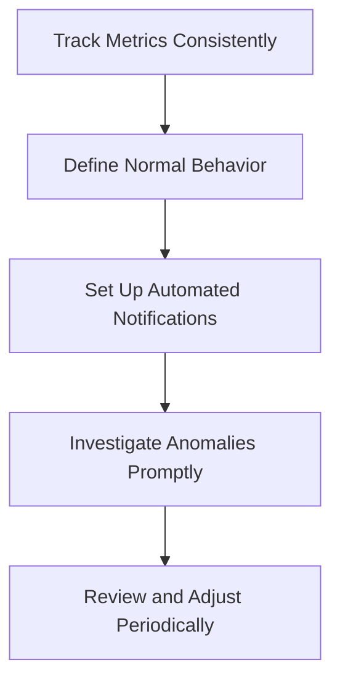

# Study Guide: Monitor Activities in Microsoft Fabric

This study guide explains how to track data movement and processing health, establish baseline metrics, perform deep diagnostics, and automate incident response using the Fabric Monitoring Hub and Activator.

---

## 1. The Critical Role of Activity Monitoring

### Operational Risks of Blind Spots
Data engineering solutions depend on tightly coupled, scheduled sequences: a Dataflow Gen2 loads raw data, a Spark notebook transforms it, and a semantic model refresh presents it to Power BI reports. If one link fails or slows down, the downstream impacts cascade immediately:
*   Reports display stale or incomplete data, leading to incorrect business decisions.
*   System capacity is wasted on silent retry loops or runaway queries.
*   Troubleshooting becomes manual guesswork when outages are reported retroactively by users.

### Target Workloads & Actionable Metrics
Different workloads require tracking different health indicators:
*   **Data Pipelines:** Group and orchestrate multiple tasks. Monitoring must track both the overall pipeline execution status and the success/failure of each individual child activity.
*   **Dataflow Gen2:** Track start time, end time, total duration, and specific write/load step failures (e.g., column mismatches or network timeouts).
*   **Semantic Model Refreshes:** Track refresh duration and retry counts. Frequent retries indicate transient network issues that may soon escalate to hard failures.
*   **Spark Jobs & Notebooks:** Track execution duration, Spark task metrics, and logs to identify data skew or poorly optimized code.
*   **Eventstreams:** Track continuous real-time parameters such as ingestion throughput, latency, and system error rates.

---

## 2. Methodology: Establishing a Monitoring Baseline

Effective monitoring is impossible without understanding what constitutes a "normal" run. 

1.  **Track Metrics Consistently:** Record duration, status, and error rates over time using historical data.
2.  **Define Normal Behavior:** After collecting several weeks of runtime history, establish typical boundaries. A 3-minute dataflow that suddenly runs for 15 minutes indicates a problem, even if it eventually succeeds.
3.  **Set Up Automated Notifications:** Configure alerts for failures so engineers are notified instantly instead of manually checking dashboards.
4.  **Investigate Anomalies Promptly:** Examine runtime deviations. Repeated spikes in duration often foreshadow impending hardware limits or source system degradation.
5.  **Review and Adjust Periodically:** As data volumes grow and code changes, update thresholds and baselines to keep alerts relevant.

---

## 3. Deep-Dive: Inside the Fabric Monitoring Hub

### Centralized Task Aggregation
The **Monitoring Hub** (accessed by selecting *Monitor* in the left navigation pane) is a centralized interface that aggregates execution histories from across workspaces. Users only see activities for items they have access to, while Fabric Admins see all tenant-wide activities.

### Activity Run Statuses
*   **Succeeded:** The task completed without errors.
*   **Failed:** The task errored. Selecting the item opens a details pane showing specific error messages and failure codes.
*   **In Progress:** The task is actively running. Unusually long runtimes indicate resource contention or stuck processes.
*   **Cancelled:** The task was terminated manually or by an external system policy (e.g., timeout or capacity limit).

### Customizing the Diagnostic Workspace
*   **Filters:** Narrow down the view by status (e.g., focusing only on *Failed* items) or item type (e.g., showing only *Notebooks*).
*   **Column Options:** Customize columns to display critical metadata, such as:
    *   *Submitted by:* Indicates if a run was manual, scheduled, or triggered by a parent pipeline.
    *   *Location:* Identifies the workspace hosting the executed item.
    *   *Duration & End Time:* Essential for comparing performance against baselines.
*   **Historical Runs:** Hovering over an activity and selecting *Historical runs* displays up to **30 days** of execution history, enabling developers to identify when performance began to degrade.

---

## 4. Advanced Diagnostics: Workspace Monitoring & Eventhouse

### raw Diagnostic Data Logs
While the Monitoring Hub is excellent for checking recent status visually, Fabric offers a deeper programmatic auditing feature called **Workspace Monitoring**.
*   **Infrastructure:** Enabling workspace monitoring provisions a dedicated **Eventhouse database** inside the workspace. This database automatically and continuously ingests logs and diagnostic metrics.
*   **KQL and SQL Auditing:** Because the raw log data is preserved in an Eventhouse, data engineers can query logs using KQL (Kusto Query Language) or SQL.
*   **Use Cases:** Essential for long-term trend analysis, correlating errors across multiple independent pipelines and notebooks, and building custom Real-Time dashboards for operations teams.
*   **Retention & Access:** Diagnostic logs are retained for **30 days** and require at least a *Contributor* role in the workspace.

---

## 5. Active Automation: Resolving Incidents with Activator

### Event-Driven Orchestration
The Monitoring Hub is reactive, showing what has already failed. **Activator** bridges this gap by automatically responding to Fabric job events in real-time.
*   **Emitted Job Events:** Activator listens for events via the Real-Time Hub, including *Job created*, *Job failed*, *Job succeeded*, and *Job status changed*.

### Alert Setup Workflow
1.  Navigate to the **Real-Time Hub** in Microsoft Fabric.
2.  Select **Fabric events** $\rightarrow$ **Job events**.
3.  Click **Set alert** to launch the configuration wizard.
4.  Specify the source event (e.g., `Microsoft.Fabric.JobEvents.ItemJobFailed`), selecting the target workspace and item.
5.  Define the trigger conditions (e.g., run on every event, or filter by specific metadata values).
6.  Assign the automated action.

### Available Automated Actions
*   **Email:** Sends a standard notification containing the error context and a direct link to the Monitoring Hub.
*   **Teams:** Posts a message directly to a user, group chat, or channel. Ideal for alerting on-call teams immediately.
*   **Run a Fabric Activity:** Triggers another pipeline, notebook, dataflow, or Spark job.
    *   *Example:* When a data loading job fails, Activator can automatically trigger a "cleanup" Spark notebook to delete half-written files, preventing subsequent runs from corrupting data.

---

## 6. Tool Selection Guide: Activator vs. Schedule Failures

To choose the right alerting mechanism, follow this design matrix:

| Use Case Scenario | Selected Tool | Reason |
| :--- | :--- | :--- |
| **Email alert when a scheduled item fails** | **Schedule Failures Page** | Provides simple, centralized configuration for routine email notifications. |
| **Teams notification to a channel on failure** | **Activator** | Sends alerts to modern team messaging channels. |
| **Notify analysts when a model refresh succeeds** | **Activator** | Listens for success events as well as failures. |
| **Trigger a downstream pipeline upon upstream success**| **Activator** | Orchestrates dependent processes across different workspaces or items. |
| **Run a cleanup script after a partial load fails** | **Activator** | Performs automated recovery steps (self-healing). |
| **Manage notification lists centrally** | **Schedule Failures Page** | Allows workspace contributors to manage all scheduled email notifications in one view. |
